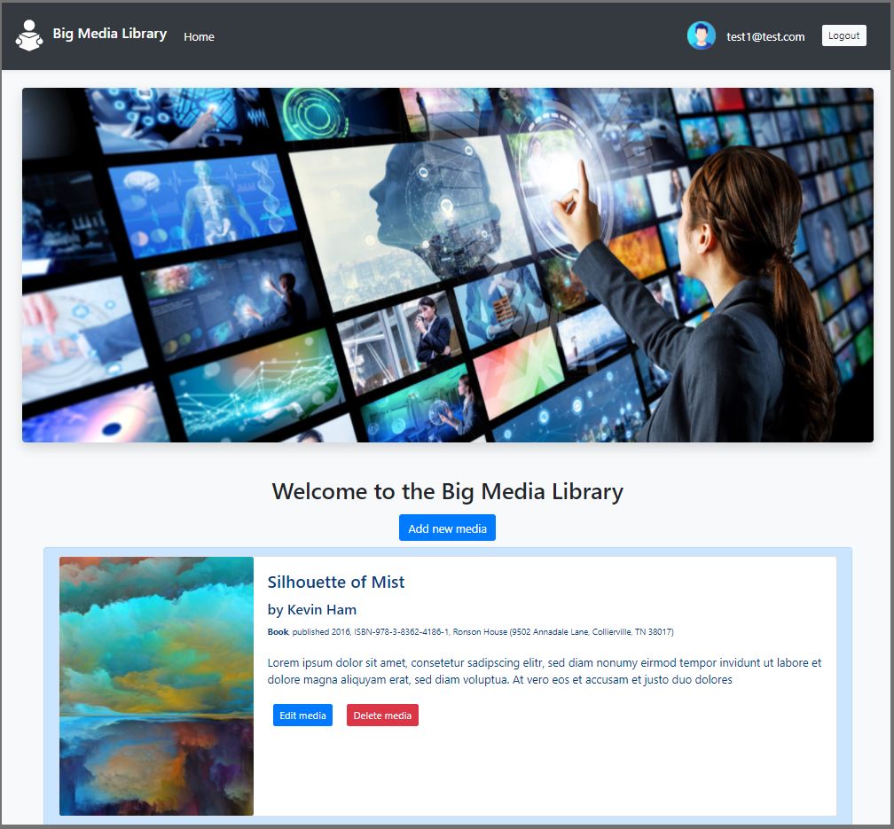

# CFLMS MarinBalabanov CodeReview 10

This is the __Big Library web application__, a big list of all media available in the library (books, CDs, DVDs) available over the web.

The database is called _cflms-marinbalabanov-codereview-10_. Please import the database in the folder _db_export_.
The columns of the main table __Media__ ( * ) are:
- title
- image (HTTP link to an image)
- first_name
- last_name
- ISBN code
- short_description
- publish_date
- publisher_name
- publisher_address
- publisher_size
- type (book, CD, DVD). Additionally
- status (“available” or “reserved”; required for Bonus Points).

